# Machine Learning Engineer Nanodegree
## Capstone Project
Yusuke Kawanabe
December 31st, 2050

## I. Definition

### Project Overview
Nowadays Understanding user behavior and taking actions based on data is a key for customer success and profitability. Starbuck coffee, a coffee chain in America has successfully developed a mobile application platform to achieve this. Once every few days, Starbuck sends out an offer to users of the mobile app. An offer can be merely an advertisement fo a drink or an actual offer such as a discount or BOGO (buy one get one free). Some users might not receive any offers during certain weeks.

### Problem Statement
It is important for marketers to be able tell how well an offer will perform in order to run effective campaigns. This problem can break down to multiple sections, such as choosing the right parameter for a target audience, finding the audience that can give the most outcome, analyzing user behavior after they used an offer, predicting how many user will use a certain offer. In this project, I will build a model which can give prediction on  wether or not a user will complete the offer or not by using machine learning predictors. 
The model is going to  be binary classifier because the outcome we want to expect is binary, if a user will complete the offer or not. The model will take an offer as input and gives how much percent of users will complete the offer. 
In order to achieve this, I will first explore the dataset to have better understanding. Secondly, I will clean up the dataset so that machine learning models can utilize the data, which includes normalization. Once the dataset is ready, I will use XGBoost as a benchmark model. XGBoost is an optimized distributed gradient boosting library, which AWS Sagemaker  estimator provides easy to use support. Finally, I will use other models, such  as the support vector machine, the logistic regression, the k-nearest neighbors vote, to compare the performance suited for our purpose to predict offer completion.

### Metrics
I will use ROC-AUC as a main metric. This is a graphical plot using the true positive rate (TPR) and the false positive rate (FPR) at various threshold to illustrate optimal model. ROC-AUC is suited for balanced data because TPR and FPR only depends on positives and if the dataset is imbalanced ROC-AUC won’t capture precision. In this case, dataset is balanced as shown in data exploration section and we can use ROC-AUC as the main metric.
Additionally, accuracy with validation data will be accounted as main metrics.


## II. Analysis

### Data Exploration
The dataset is provided by Udacity and downloaded to my project. There is three files.

* portfolio.json - containing offer ids and meta data about each offer (duration, type, etc.)
* profile.json - demographic data for each customer
* transcript.json - records for transactions, offers received, offers viewed, and offers completed

Here is the schema and explanation of each variable in the files:

#### portfolio.json
* id (string) - offer id
* offer_type (string) - type of offer ie BOGO, discount, informational
* difficulty (int) - minimum required spend to complete an offer
* reward (int) - reward given for completing an offer
* duration (int) - time for offer to be open, in days
* channels (list of strings)

There is three kinds of offer type:

* bogo
* informational
* discount

For channels, we have below as value:

* web
* email
* mobile
* social

Portofolio data contains 10 rows and the data looks like below:

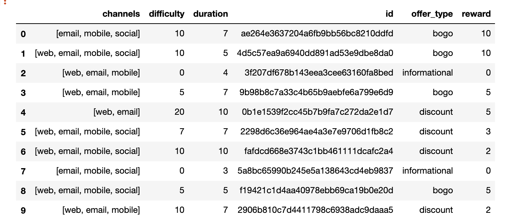
*Sample of protfolio.json*

#### profile.json
* age (int) - age of the customer
* became_member_on (int) - date when customer created an app account
* gender (str) - gender of the customer (note some entries contain ‘O’ for other rather than M or F)
* id (str) - customer id
* income (float) - customer’s income

The data sample looks like below:

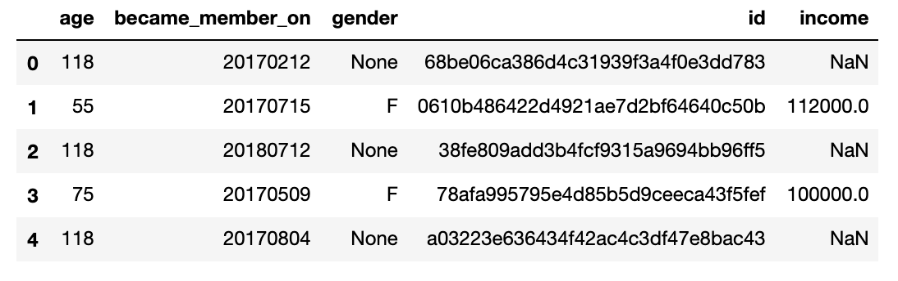
*Sample of profile.json*

#### transcript.json
* event (str) - record description (ie transaction, offer received, offer viewed, etc.)
* person (str) - customer id
* time (int) - time in hours since start of test. The data begins at time t=0
* value - (dict of strings) - either an offer id or transaction amount depending on the record

This json file contains 4 types of events. Those events represents key events for offer completion.

* transaction
* offer received
* offer viewed
* offer completed

Each of these has different dictionary value set in the value column. For example, for transaction event, the dictionary contains amount of money transacted, and for offer completed, it's offer id.

The data has 306534 rows and the data sample looks like this.

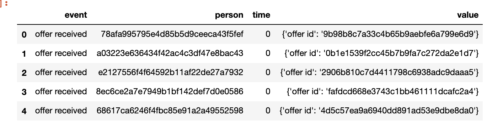
*Sample of transcript.json*

### Exploratory Data Analysis

#### portfolio.json

This data only contains 10 rows. 

Channel row contains arrays of strings, and this is not machine learning model friendly, although it is expected that different channel have different influence on users. I will have to separate them to separate columns. 

#### profile.json

We have 17000 customer data set. The data seems incomplete because some data contains 118 for age, None for gender and NaN for income. Let's take a look at distribution of each features.

Age distribution is shown below. This shows people who is over 118 years old is the biggest population, which seems not realistic given average life expectancy in the U.S. is 72 years old. It is most likely the default value set by the system. I will replace this value with the average in the data preprocessing phase.

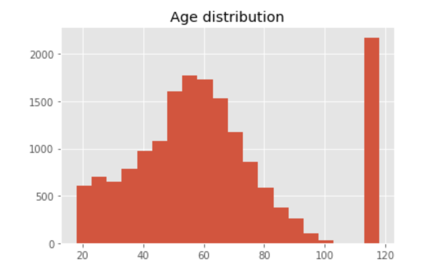
*Age distribution in profile.json*

The income distribution is shown below, and it seems reasonably distributed given it looks like normal distribution except for `NaN` rows. I will replace this `NaN` values with the average.

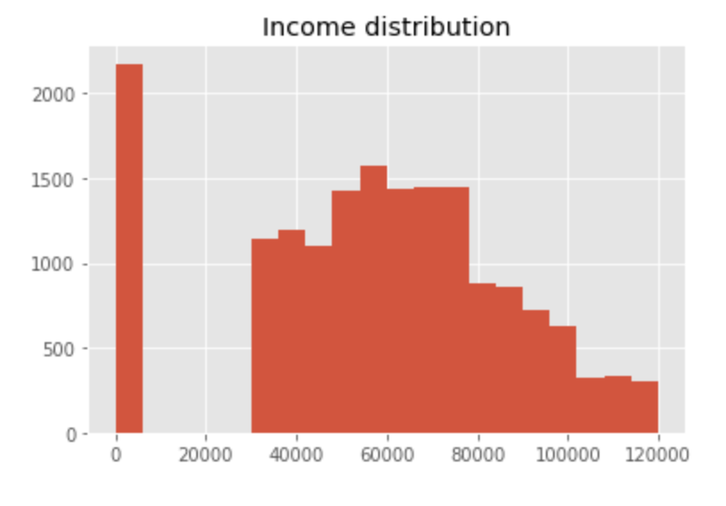
*Income distribution in profile.json*

The image above is a scatter plot with income and age. This highlights that there is income cut off for each age groups. For example, people in 20s and 30s have income cutoff somewhere around 750K. This indicates that the profile data is arbitrarily created. This may make prediciton simpler because user segmentation is clearler. 

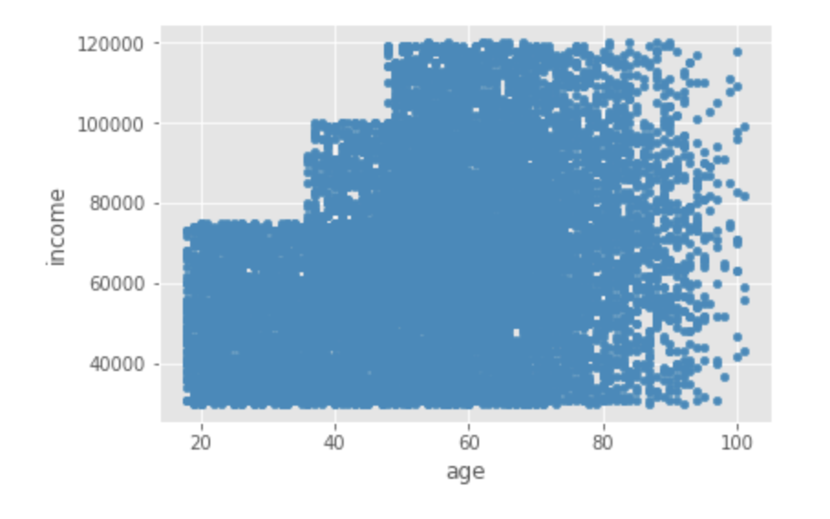
*Income and age scatter plot from profile.json*

The chart below is gender distribution from profile.json. This shows gender column has some anomally values, 0 and O. I made an assumption they are default vaue or indicates user has not selected gender.

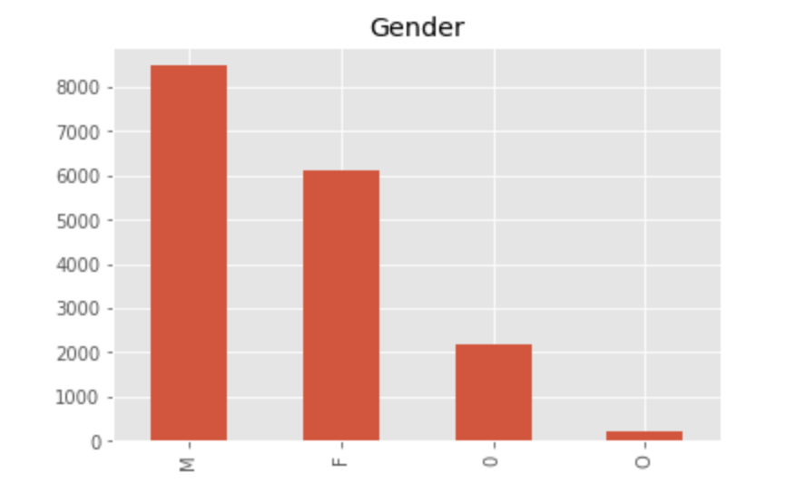
*Gender distribution in profile.json*

#### transcript.json

The data has 306534 rows. This transcript data contains for types of events and each event has different values. Therefore, we will need to separate them during data preprocessing.

Let's first take a look at number of each event as shown below. As expected, the number of events decrease as offer funnel proceeds from offer received to offer completed. Additionally, although transaction has the biggest data, this event should be treated differently because the nature of the event is different from other events. 

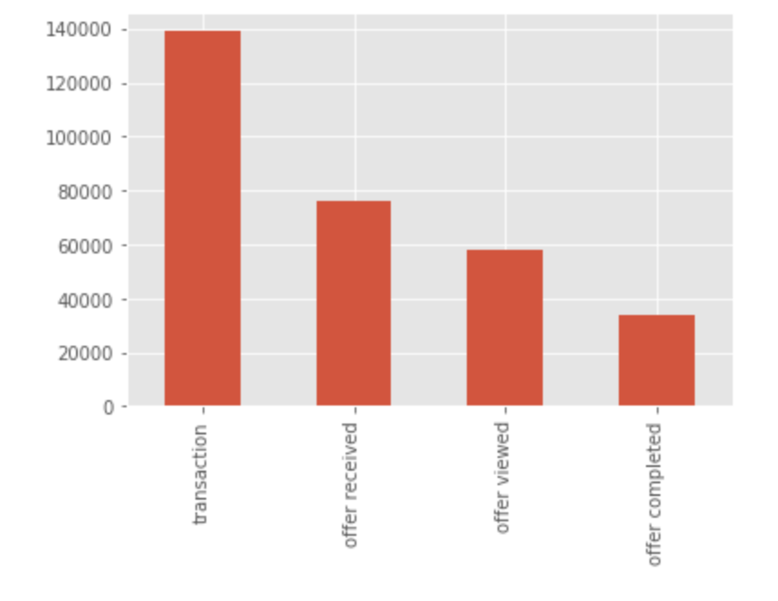

*Event distribution in transcript.json*

Here is distribution of transaction count per user. More users had a few transaction and less users had many transactions as expected.

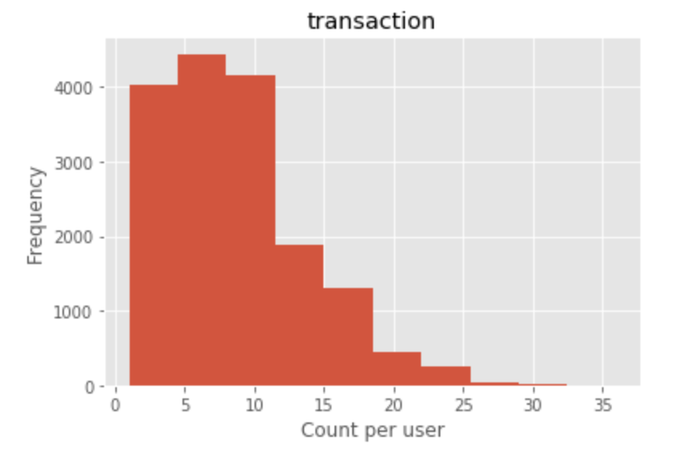
*Distribution of transaction count in transcript.json*

The box graph below shows distribution of offer event including received, viewed and completed per user. As expected number is skewed high for the received, middle for the viewed and low for completed. This indicates that offer events has very realistic distribution. Additionally, the number of offer received data is 76277 and the number offer completed is 33579. This indicates that data is balanced.

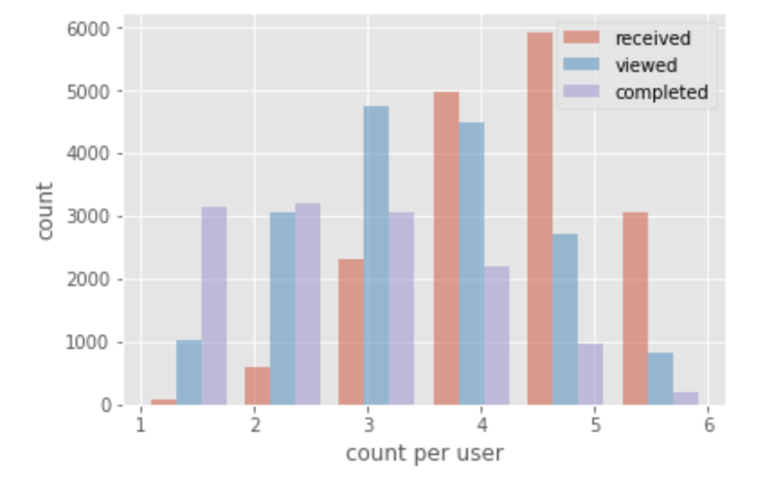
*Distribution of offer event count in transcript.json*

### Algorithms and Techniques
The goal for this project is to come up with a model that can accurately predict wether user will complete the offer or not. This is supervised binary classification problem.

I will use the logistic regression model, multi layer perceptron, random forrest classifier, the k-nearest neighbors vote, support vector machine and AdaBoost classifier.

Logistic regression is a probability model which is used for 0/1 problems. This model is used in variety of field such as medical and engineering.In this model, sigmoid function is used. It takes takes in user profile and offer data as input and gives an steep curve at which y value changes. an arbitral threshold is selected and depends on the threshold you can change sensitiveness of the model. I will use `LogisticRegression()` in sklearn for this problem.

Multi layer perceptron is consists of multiple layer of perceptorons as the name suggests. Perceptron is mathematic model represented by an activation function such as a step function or a sigmoid function, which sends output to the next layer if it hits certain threshold. The benefit of the model is it can learn non-linear models, which allows us to create complex models. However, this is sensitive to to feature scaling. Hence, we will normalize the data in preprocessing. `MLPClassifier()` in sklearn is used in this paper.

Random forrest classifier is a classification method uses multiple decision trees from randomly selected subset of training data. Sometimes simple random forest classifier performs better than other complicated models. `RandomForestClassifier()` from sklearn is used in the implementation. 

The k-nearest neighbors vote classifies using majority vote of it's neighbors, with the object being assigned to the class most common to its k-nearest neighbor. The main feature of this model is being non-parametric method. This makes the model suitable for data with a lot of unknowns and outliers. `KNeighborsClassifier()` from sklearn will be used in the implementation.

Additionally, support vector machine is a classifier model which finds a hyper plane which separates one or the other of two categories. It is represented as `SVN()` in sklearn.

And finally AdaBoost classifier is a classifier used in conjunction of bunch of weak learners. The benefit of the class is this model provides relatively accurate predictions without much of parameter tuning. However, AdaBoost is sensitive to outlier and noisy data. `AdaBoostClassifier()` class from sklearn is used in this project.

To simplify the problem, I'm not considering time series of user behavior. For example, it's natural to think an user who has transaction every month would not come back to a store til next month, taking it account would help improve the model. However, for this iteration, I will use user profile and offer information to tell if an user is likely to react to offers.

### Benchmark
As benchmark, I used XGBoost binary classifier provided on Sagemaker. I ended up using XGBoost because the model can be easily accessed on AWS. Additionally, it is known for providing good predictions and won some Kaggle competitions. 

The parameter of predictor is defined as below:

```py
xgb.set_hyperparameters(max_depth=5,
                        eta=0.2,
                        gamma=4,
                        min_child_weight=6,
                        subsample=0.8,
                        silent=0,
                        objective='binary:logistic',
                        early_stopping_rounds=10,
                        num_round=500)
```

20 % of data is used for test data to calculate accuracy score of the model, which turned out 0.795.

## III. Methodology

### Data Preprocessing

THe first step was to clean up each data to remove anomaly and convert some data to easier to digest format for models. Then I combined those data to generate input features and label. Finally, combined data is normalized.

#### Portfolio
For portfolio, we first need to convert channels to binary columns from arrays of strings. Additionally, I converted `offer_type` to binary columns based on the value of the original column. This way all models can digest those values well. I also replaced `id` with `offer_id` to concatenate other data. The function I used to clean up looks like below:


```python
def clean_portfolio(data):
    p = data.copy()
    p['web'] = p['channels'].apply(lambda x: 1 if 'web' in x else 0)
    p['email'] = p['channels'].apply(lambda x: 1 if 'email' in x else 0)
    p['mobile'] = p['channels'].apply(lambda x: 1 if 'mobile' in x else 0)
    p['social'] = p['channels'].apply(lambda x: 1 if 'social' in x else 0)
    p.drop(['channels'], axis=1, inplace=True)
    
    p['bogo'] = p['offer_type'].apply(lambda x: 1 if 'bogo' in x else 0)
    p['discount'] = p['offer_type'].apply(lambda x: 1 if 'discount' in x else 0)
    p['informational'] = p['offer_type'].apply(lambda x: 1 if 'informational' in x else 0)
    p.drop(['offer_type'], axis=1, inplace=True)
    
    p['offer_id'] = p['id']
    p.set_index('offer_id', inplace=True)
    p.drop(['id'], axis=1, inplace=True)
    
    return p
```

The sample data of cleaned portfolio looks like below. `offer_id` will be used for concatenation.

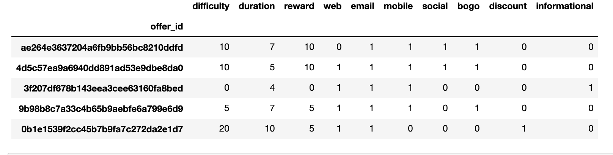
*Cleaned portfolio data*

#### Profile

As mentioned above, age column has the default value 118, and it will be treated as anomaly if I leave it as is. I converted age to the mean of values that is not 118. Likewise, I took mean of income as well.

Gender is also missing some data. First, I created three columns for gender instead, `male`, `female` and `no_gender` and they take binary integer. I replaced all genders to those 3 columns and used `no_gender` if the value is not `F` or `M`.

`id` was replaced with `profile_id` for concatenation.

I replaced `become_member_on` with `member_days` which shows number of days since you became member. This makes it a single integer value and makes it easier to understand for ML models.

Here is the function I used to clean profile data:

```py
def clean_profile(df):
    p = df.copy()
    p['age'] = p['age'].apply(lambda x: np.nan if x == 118 else x)
    p['age'] = p['age'].fillna(p['age'].mean())
    
    p['income'] = p['income'].fillna(p['income'].mean())
    
    p['male'] = p['gender'].apply(lambda x: 1 if x == 'M' else 0)
    p['female'] = p['gender'].apply(lambda x: 1 if x == 'F' else 0)
    p['no_gender'] = p['gender'].apply(lambda x: 1 if x != 'F' and x != 'M' else 0)
    p.drop(['gender'], axis=1, inplace=True)

    p['profile_id'] = p['id']
    p.drop(['id'], axis=1, inplace=True)
    p.set_index('profile_id',inplace=True)

    p['member_days'] = (datetime.datetime.today().date() - pd.to_datetime(p['became_member_on'], format='%Y%m%d').dt.date).dt.days
    p.drop(['became_member_on'], axis=1, inplace=True)
    return p
```

And here is the sample converted data:
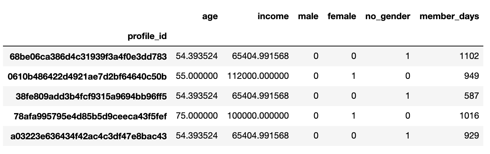
*Cleaned profile data*

#### Transaction
For transaction, I separate data to transaction and offer related based on `event` field. The leaning model I used does not consider historical transaction data. Therefore, we can ignore transaction events. Of course, to improve the model, we can potentially use this data with time series analysis. 

I clean offer by first replacing `person` column name with `profile_id`. Then, extract `offer_id` from `value` field to concatenate eventually. Then instead of `event`, I created 3 columns for corresponding value using binary values, `offer_completed`, `offer_received` and `offer_viewed`.

I dropped `time` because I'm not considering timeline of transaction and user behavior in this model.

Here is the code used to clean offers.


```py
def clean_offer(df):
    d = df.copy()
    d['profile_id'] = d['person']
    d.drop(['person'], axis = 1, inplace = True)
    
    d['offer_id'] = d['value'].apply(lambda x: x['offer id'] if 'offer id' in x.keys() else x['offer_id'] if 'offer_id' in x.keys() else np.nan)

    d['event'] = d['event'].apply(lambda x: x.replace(" ", "_"))                                 
    event_df = pd.get_dummies(d['event'])    
    d = pd.concat([d, event_df], axis=1)

    d.drop(['value', 'time', 'event'], axis = 1, inplace = True)
    d.reset_index(drop=True, inplace = True)
    return d
```

Here is cleaned transaction:

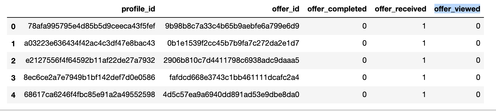
*Cleaned transaction data*


#### Concatenation and normalization 

The data is concatenated using `offer_id` and `profile_id`. When you aggregate, I can take summation for `offer_completed`, `offer_received` and `offer_viewed` because it's possible that users receive the same offer multiple times. However, to simplify, I didn't take the number of offer received in consideration and dropped the column. I separated `offer_completed` to used it as label.

After that the data is normalized using `MinMaxScaler` in sklearn for non-binary values, `age`, `income`, `difficulty`, `duration`, `reward`, and `member_days`. 

At the end, we get features looks like below:

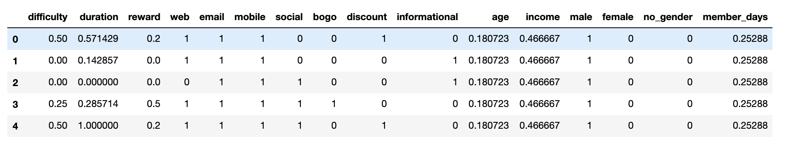
*Cleaned features*


### Implementation

I wrote a function which takes sklearn model and runs training and validation, which looks like below.

```py
def train_predict(model, X_train, y_train, X_test, y_test):
    print('Name: {}'.format(model.__class__.__name__))
    
    model.fit(X_train, y_train)
    y_pred = model.predict(X_test)
    
    score = model.score(X_test, y_test)
    print('Test score: {:.3f}'.format(score))
    accuracy = accuracy_score(y_test, y_pred)
    print('Accuracy score: {:.3f}'.format(accuracy))

    probs = model.predict_proba(X_test)[:, 1]
    auc = roc_auc_score(y_test, probs)
    print('AUC: %.2f' % auc)
    fpr, tpr, _ = roc_curve(y_test, probs)
    
    return {'y_pred': y_pred, 'auc': auc, 'fpr': fpr, 'tpr': tpr, 'score': score, 'accuracy': accuracy}
```

This function fit the model using training data and gives prediction based on test data. Afterwords it calculates test score and accuracy score. Additionally, AUC is also returned. At the end those two values are used as main measurements of model performance. 

All models are defined in sklearn library, and in general, default value is used for the sake of simplicity. The model definition is below.

```py
from sklearn.linear_model import LogisticRegression
from sklearn.svm import SVC
from sklearn.tree import DecisionTreeClassifier
from sklearn.neighbors import  KNeighborsClassifier
from sklearn.neural_network import MLPClassifier
from sklearn.ensemble import RandomForestClassifier
from sklearn.ensemble import AdaBoostClassifier

models = []
models.append(SVC(probability=True))
models.append(MLPClassifier())
models.append(LogisticRegression())
models.append(KNeighborsClassifier())
models.append(SVC(kernel='linear',probability=True))
models.append(RandomForestClassifier())
models.append(AdaBoostClassifier())
```

I take this array of models and for looped them to train the model. During the for loop, it keeps track of the best score and gives best method and best score based on it. Additionally, it plots ROC-AUC curves. The code is shown below.

```py
best_score = 0
best_method = ""

for model in models:
    result = train_predict(model, X_train, y_train, X_test, y_test)
    fpr, tpr, auc = result['fpr'], result['tpr'], result['auc']
    plt.plot(fpr,tpr,label="{}, auc={}".format(model.__class__.__name__, str(auc)))
    
    if result['score'] > best_score:
        best_method = model.__class__.__name__
        best_score = result['score']

plt.xlabel('False Positive Rate')
plt.ylabel('True Positive Rate')
plt.title('Receiver Operating Characteristic (ROC) Curve')
plt.legend()
plt.show()

print('---------------------------------')
print('best_method：', best_method)
print('best_score：', best_score)
```


### Refinement
I started off with using Sagemaker Estimator objects to optimize model learning process by using GPU instances. However, it turned out sklearn provides much simpler interface which allows me to reuse code and simplify the process. Additionally, since I simplified the problem, machine learning fitting process does not take long time. Therefore, I sticked with sklearn and added more models than I originally planned.

## IV. Results

### Model Evaluation and Validation

The table below is the result of test score and AUC for each model. ROC curve chart is provided as well. The numbers do not vary marginally, and almost within the error range. MLPClassifier and AdaBoostClassifier performed slightly better than other models. 
In order to verify the models are not overfitting, I conducted cross validation using `cross_val_score()` function in sklearn. Both MLPClassifier and AdaBoostClassifier gave pretty similar score as the original experiment. Given we have 33579 offer completed data, this result indicates the model is not overfitting.

|Model name|Test score|AUC| 
|---|---|---|
|SVC (linear)|0.767|0.86|
|MLPClassifier|0.784|0.88|
|LogisticRegression|0.765|0.85|
|KNeighborsClassifier|0.764|0.84|
|SVC|0.766|0.85|
|RandomForestClassifier|0.763|0.85|
|AdaBoostClassifier|0.782|0.88|

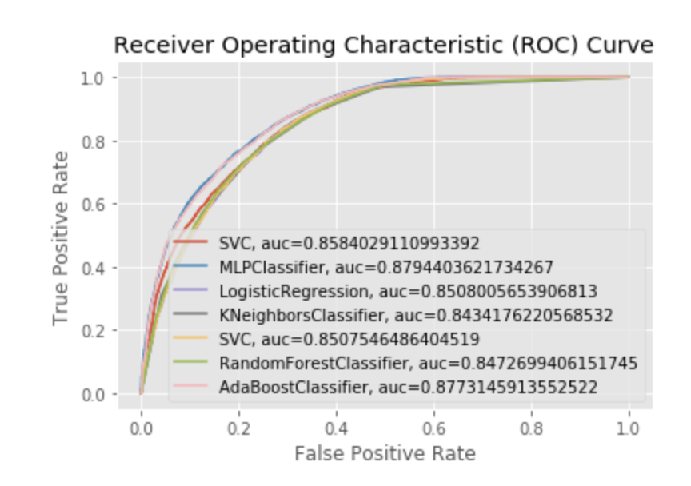
*ROC curve*

Given all of this MLPClassifier seems the best model within the models I tested. However, this did not give better model than XGBoost with default value, although this simple model provided almost almost 80% accuracy for Starbuck app offers. 


## V. Conclusion

The result showed how storng out of the box XGBoost. XGBoost model was often used as the best model in Kaggle competetion like Otto Group Product Classification Challenge for example. 

Of course, possible improvement is to optimize parameters for both XGBoost and MLPClassifier, and to see which performs better. For sklearn models, we can achieve this hyperparameter tuning using grid search (`GridSearchCV`) or random search (`RandomizedSearchCV`). 

Additionally, in this case, for the sake of simplicity, I did not include time series data. We can potentially use something like DeepAR to train models using this aspect.


## Reference
* [XGBoost Documentation](https://xgboost.readthedocs.io/en/latest/)
* [ROC and AUC, Clearly Explained!](https://www.youtube.com/watch?v=4jRBRDbJemM)
* [Receiver operating characteristic](https://en.wikipedia.org/wiki/Receiver_operating_characteristic)
* [Logistic regression](https://en.wikipedia.org/wiki/Logistic_regression)
* [scikit-learn](https://scikit-learn.org/stable/index.html)
* [Machine Learning101](https://medium.com/machine-learning-101)
* [AdaBoost](https://en.wikipedia.org/wiki/AdaBoost)
* [Otto Group Product Classification Challenge](https://www.kaggle.com/c/otto-group-product-classification-challenge/discussion/14335)